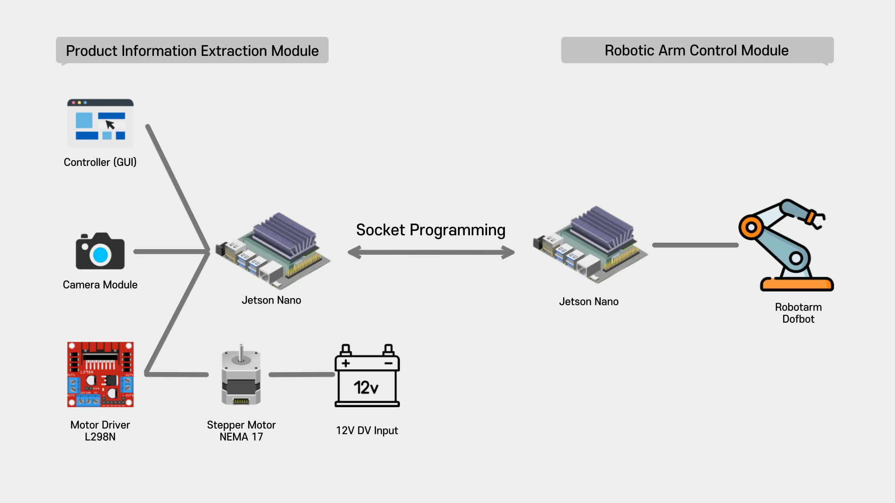
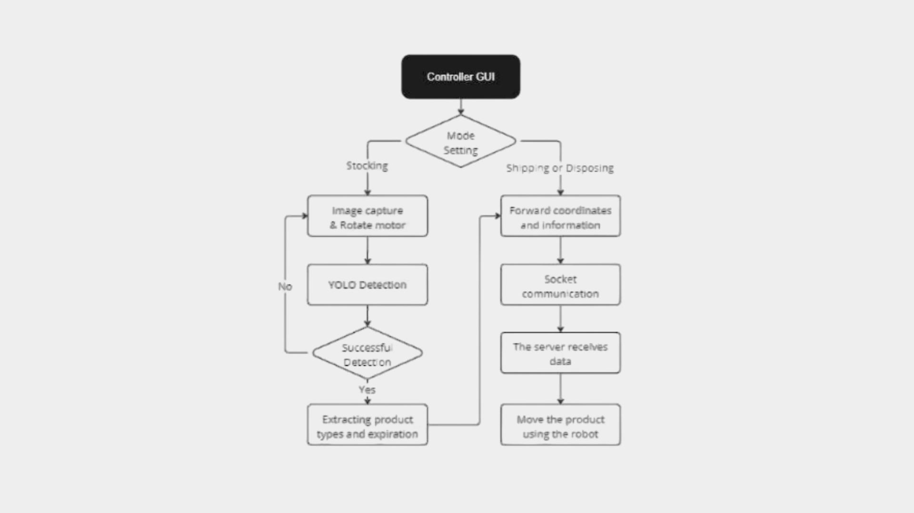

# 인공지능을 활용한 유통관리 시스템

## 프로젝트 개요

- **프로젝트 명**: 인공지능을 활용한 유통관리 시스템
- **프로젝트 기간**: 2022.09 ~ 2023.06
- **개발 언어 및 환경**: Python, PyTorch
- **팀원**: 최재용, 김수현, 이우영, 안정현 (4명)

## 프로젝트 설명

본 프로젝트는 YOLOv5 기반 객체 탐지 기술을 활용하여 제품의 유통기한(혹은 소비기한) 및 바코드 정보를 자동으로 추출하는 유통관리 시스템을 구축하는 것을 목표로 합니다. 시스템은 실시간으로 제품의 유통기한과 제품 정보를 파악하고, 입고 및 출고를 자동으로 제어함으로써 유통관리의 자동화를 실현합니다.

## 주요 역할

- 유통기한 탐지를 위한 객체 탐지 모델 훈련 및 성능 향상
- 제품 제어를 위한 로봇팔 서버 소켓 통신 기능 구현
- 모터 및 로봇팔 하드웨어 제어 코드 구현

## 시스템 설계

### 시스템 구성

본 유통관리 시스템의 전체 구성은 다음과 같습니다.

### 시스템 알고리즘 및 동작 흐름

위 그림은 제안하는 유통관리 시스템의 동작 흐름을 시각적으로 보여주는 흐름도입니다. 시스템은 다음과 같은 과정을 거쳐 자동화된 유통관리를 수행합니다:

1. **입고 과정**:

   - 카메라 모듈과 모터를 사용해 제품의 각 면을 정확한 각도로 촬영.
   - 얻은 4개의 이미지는 객체 탐지 모델의 입력으로 사용.
   - 유통기한(소비기한) 검출을 위해 이미지에서 해당 부분을 잘라내고, OCR을 통해 텍스트 추출.
   - OCR 인식률을 높이기 위해 이미지를 이진화.
   - 바코드 부분은 Pyzbar 라이브러리를 활용해 번호를 추출하고, 제품 정보를 획득.

2. **데이터 처리**:

   - 추출된 데이터는 유통기한(소비기한)을 기준으로 정렬.
   - 데이터 전송은 소켓 통신을 통해 이루어짐.
   - 로봇팔 제어부는 서버로 구성되어 입고된 제품의 정보와 좌표를 수신하여 재고관리 작업을 자동으로 수행.

3. **출고 및 폐기 과정**:
   - 출고할 제품이나 유통기한이 지난 제품의 정보와 위치 좌표를 서버로 전송.
   - 제품을 출고하거나 폐기 처리.
   - 나머지 제품은 재배치하여 자동화된 입고, 유통기한 관리, 출고, 폐기 등의 작업 수행.

## 최종 결과

### 유통기한 추출

### 로봇팔 제어를 통한 재고 관리

### 최종 결과물

## 결론

본 프로젝트를 통해 개발된 인공지능 기반 유통관리 시스템은 제품 추적성, 유통기한 관리, 재고 관리 등에서 비용과 시간을 절약하면서도 높은 정확성을 달성함으로써 효율적인 유통관리를 가능하게 할 것으로 기대됩니다.

## 참고 문헌

1. Yang-Jae Park, "Design of Multiple Barcode and QR Code Recognition System with Real-time Object Detection Technology", Journal of KIIT, Vol. 20, No. 9, pp. 19, 2022.
2. Connor Shorten, Taghi M. Khoshgoftaar, “A survey on Image Data Augmentation for Deep Learning“, Journal of Big Data, Vol. 6, Article 60, 2019.
3. [YOLOv5 Documentation](https://pytorch.org/hub/ultralytics_yolov5/)
